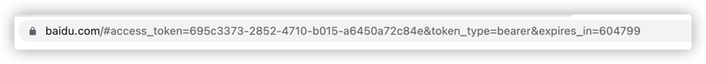
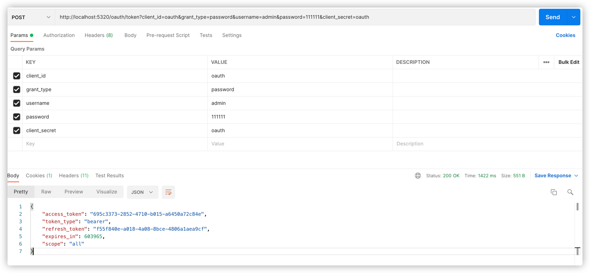

# Spring Security Oauth2

# 授权码模式
## 获取授权码
http://localhost:5320/oauth/authorize?client_id=oauth&response_type=code&scope=all&redirect_uri=http://www.baidu.com

## 根据得到的code获取token

# 简化模式
http://localhost:5320/oauth/authorize?client_id=oauth&response_type=token&scope=all&redirect_uri=http://www.baidu.com

授权之后结果

# 密码模式
http://localhost:5320/oauth/token?client_id=oauth&grant_type=password&username=admin&password=111111&client_secret=oauth

# 客户端模式

http://localhost:5320/oauth/token?client_id=oauth&client_secret=oauth&grant_type=client_credentials

